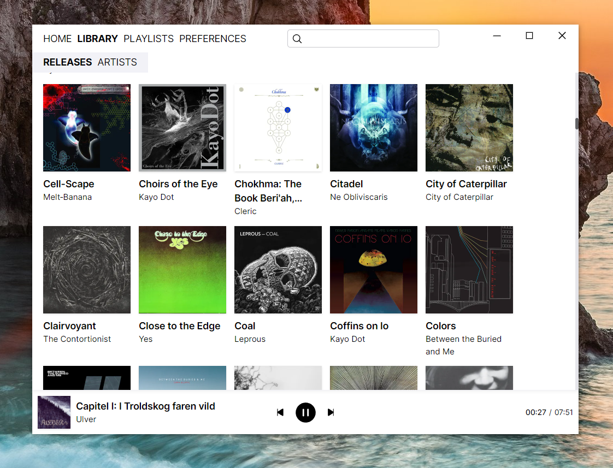
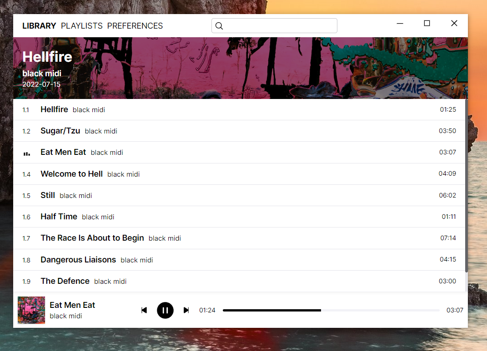

N# Grass Music Player
An opinionated desktop music player with **gap-less playback** that aims to be **minimal and polished**.

## Project Status
I'm rewriting this thing using tauri, the previous prototype built with electron did not meet my expectations, in concrete the overall memory usage, it was using around 250mb when playing music and 150mb on idle, since tauri uses rust over node an immediate gain is perceivable.

Some screenshots of the new rewrite:

